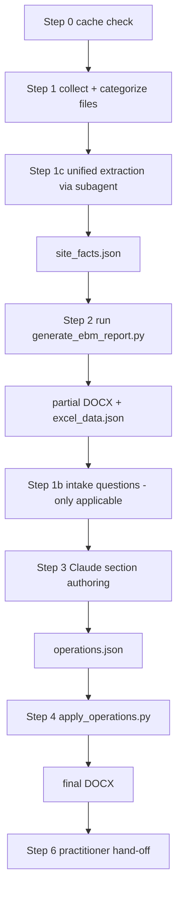
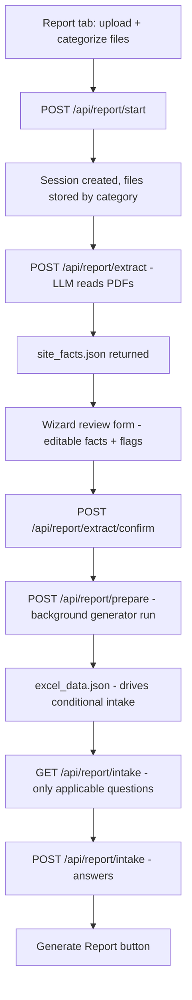
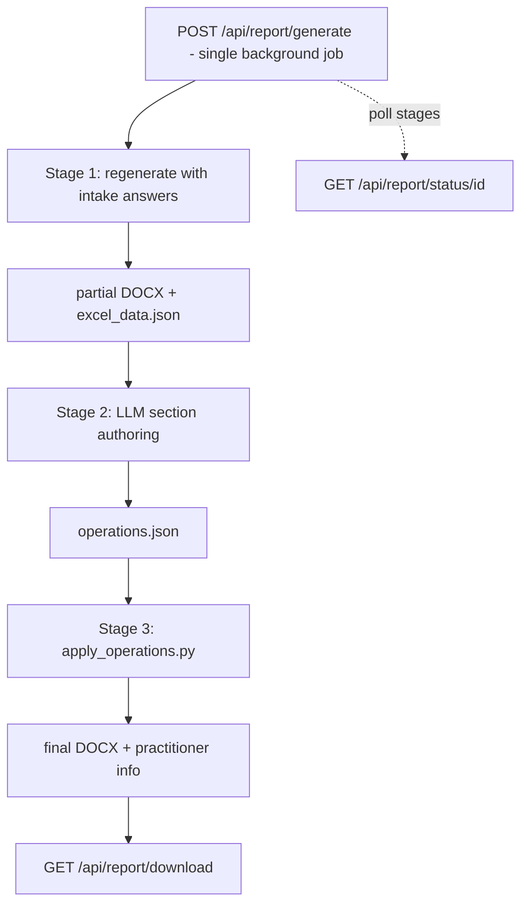

# AI Reporting — Webapp Integration Plan

Integrate the `ebm-routine-report` Claude skill (currently run in Claude Desktop) into
`ebm-sst-webapp` as a new **Report Generation** phase/tab, reusing the analytical Excel
workbook and figures zip the app already exports.

## Confirmed decisions

1. **Target app:** `ebm-sst-webapp` — new Report Generation phase/tab. The Excel + figures
   zip from the analysis run are reused server-side (no re-upload needed), with an option to
   upload a different Excel if desired.
2. **File categorization:** frontend dropdowns per uploaded file (auto-suggested from
   filename heuristics, user-confirmed). **No LLM calls for categorization.**
3. **Site-facts extraction (skill Step 1c):** automated — backend calls the LLM provider to
   read ABAData/Phaseview/Phase 1 ESA/borehole logs and produce `site_facts.json` (mirrors
   the skill's subagent). The wizard then shows the extracted facts in an **editable review
   form** before generation.
4. **Intake questions:** structured wizard form only — no chat, no notes box. Only the
   questions that apply are shown (conditional on `excel_data.json` + `site_facts.json`).
   The six questions are a fixed, known set with fixed answer types (radio/text/number),
   so no LLM call is needed for intake.
5. **Hands-off generation:** all user interaction happens in the first (wizard) phase.
   Once the intake wizard has everything it needs, report generation runs **completely
   hands-off** — one "Generate Report" action runs the full pipeline (regenerate with
   intake answers → LLM authoring → apply operations → practitioner info) as a single
   background job with progress stages. The user watches progress but never answers
   questions mid-pipeline.
6. **Authoring (skill Step 3):** per-section LLM calls using the skill's prompt files →
   operations JSON → `apply_operations.py`.
7. **Async model — non-blocking:** every long-running step (extraction, prepare, hands-off
   pipeline) runs as a **background job**; the endpoint returns immediately (HTTP 202) with
   a `job_id`, and the frontend polls `GET /api/report/status/{id}` for progress stages.
   A 5-minute PDF extraction must never block the request handler (browser/proxy timeouts
   are typically 30–60s). Implementation: an in-process thread-pool job runner + status
   store in `jobs.py` (right-sized for a single-user internal tool; upgrade path is
   Redis + RQ/ARQ behind the same interface). The OpenRouter HTTP client needs a generous
   timeout (e.g. 10+ min) so long LLM calls aren't cut off.
8. **LLM provider: OpenRouter** (OpenAI-compatible) — no Claude API key required. Config via
   `OPENROUTER_API_KEY` + `REPORT_MODEL` env vars. **Start with a Claude model served
   through OpenRouter** (e.g. `anthropic/claude-sonnet-4-*`) so the webapp exactly mimics
   the current Claude Desktop setup, then switch to DeepSeek or another model as needed —
   the provider abstraction makes this a one-line env change. The skill's prompts are
   model-agnostic markdown instructions; only the transport changes.

## The skill workflow being automated

## Webapp flow

**Interactive phase (wizard — all user interaction):**

**Hands-off phase (one action, no user input):**

## Integration gaps found in the current webapp export

The routine skill's generator reads sheets the webapp export does **not** produce:

| Sheet / folder | Skill needs it for | Webapp status | Fix |
|---|---|---|---|
| `Borehole Rationale` | Section 4.1 table, DWDA sump detection, Section 7.1 APEC review | **Missing** — no frame exists | **User will fix** (out of scope for this plan) |
| `Site Summary` | Section 2.8 Exposure Pathway Evaluation (Land Use/Texture/Strata/COPCs) | **Missing** | **User will fix** (out of scope for this plan). Generator degrades gracefully if absent |
| `BG_CHLORIDE/` folder in figures zip | Section 5.3 footprint figures | Webapp writes `BG_Chloride/` (mixed case) — breaks on case-sensitive FS (Linux/Docker) | **User will fix** (out of scope for this plan) |
| `CL_DELINEATION/` folder in figures zip | Section 4.3 chloride profile figure grid | **Missing** — `cl_delineation.py` exists but charts aren't zipped | **User will fix** (out of scope for this plan). Generator inserts "Not applicable" if absent |

Also: the webapp export is `.xlsx` (skill accepts `.xlsx`/`.xlsm` — fine), and the
`EC & SAR Rating Categories` / `Tier 1 Exceedances` / `Borehole_Characteristics` /
`SCARG Guideline Summary` / digit-named depth sheets the skill needs **are** already
exported.

## Vendored skill assets

Copy from `../Documents/Rob POC Claude/.skills/skills/ebm-routine-report/` into
`ebm-sst-webapp/backend/report_skill/`:

- `scripts/` — `generate_ebm_report.py`, `apply_operations.py`, `write_practitioner_info.py`
  (skip `.bak_*` files)
- `prompts/` — all section prompt files, `intake_quiz.md`, `site_facts_cache.md`,
  `exec_summary.md`, `practitioner_information.md`, `clients/*.md`
- `references/` — `Automation Template_20260924.docx` (live template), `Exposure Pathways.xlsx`
- `evals/` — keep for regression testing

Add `openai` (OpenRouter is OpenAI-compatible) + `pypdf` (PDF text extraction) +
`python-docx` (Word doc text extraction) to `backend/requirements.txt`. If the chosen
model needs page images instead of text (e.g. scanned PDFs), add `pymupdf` for
PDF→PNG rendering and pass pages as image content parts.

## New backend modules (`backend/app/report/`)

| Module | Responsibility |
|---|---|
| `session.py` | Session store (in-memory dict keyed by id, mirroring `_CONTEXT_CACHE`), file storage under a per-session dir, **non-linear state machine with back-edges** (not a strict linear flow): `files ⇄ extracting ⇄ facts_review → preparing → intake → generating → done`. Back-transitions: a flag needing a missing file returns to `files` (re-extract after upload); changed intake answers return to `preparing` (re-run the background generator to recompute conditional questions). Re-extraction can reuse cached facts for unchanged files (mirrors the skill's Step 0 cache). The hands-off phase (`generating`) is a single background job with internal stages (regenerate → author → apply → practitioner) and no user interaction |
| `llm.py` | Provider-agnostic LLM client — `openai` SDK pointed at `https://openrouter.ai/api/v1` with `OPENROUTER_API_KEY` + `REPORT_MODEL` env vars. Helpers: `complete_json()` (JSON-mode chat completion), `ingest_documents()` (PDF/Word → text or page images), message assembly. Default model = a Claude model via OpenRouter to mimic the current setup; switchable via env |
| `extract.py` | Step 1c: **one** LLM call per site-facts extraction (the webapp's equivalent of the skill's subagent) — system = `site_facts_cache.md` field list, user = ingested text/images from ABAData/Phaseview/Phase 1 ESA/borehole logs, response = `site_facts.json` schema (JSON mode). **The Excel is never read by the LLM** — it's read mechanically by the generator (`openpyxl`) into `excel_data.json`. Unresolvable/ambiguous fields are recorded as `null` + an entry in `extraction_flags[]` (per the skill's rule — the LLM never guesses). A missing source document (e.g. no ABAData or Phaseview uploaded) is itself a flag: the user either uploads the file (back to Files, re-extract) or confirms proceeding without it (generator degrades gracefully — `site_type` falls back to an intake question, Section 2.1 stays as placeholders, gap recorded in the practitioner hand-off). The review step turns each flag into a required user resolution |
| `generator.py` | Subprocess wrapper for `generate_ebm_report.py` (7 positional args: references folder, excel, output folder, site_lsd, client_name, site_facts.json, figures zip). Captures stdout + `excel_data.json` |
| `intake.py` | Intake question definitions + applicability logic (from `intake_quiz.md`): always-ask Q21, Q22(a); conditional Q22(c), Q14, Q6, Q18; auto-derived Q0/Q1 shown in review |
| `sections.py` | Per-section LLM authoring: iterates the Step 3 section table, one API call per prompt file (system = prompt content, user = site_facts.json + excel_data.json + relevant data; figure PNGs as image content parts for `s5_3_footprint.md`), collects operations |
| `operations.py` | Operation JSON validation + `apply_operations.py` subprocess wrapper |
| `practitioner.py` | Step 6: build `Practitioner_Information_<site>.docx` via `write_practitioner_info.py` |
| `jobs.py` | **Non-blocking** background job runner — in-process thread pool + status store keyed by `job_id` (pending/running/done/error, progress stages, partial results). Endpoints return HTTP 202 with `job_id` immediately; the frontend polls `GET /api/report/status/{id}`. Long LLM calls run in background threads with generous HTTP timeouts |

## New endpoints

| Endpoint | Purpose |
|---|---|
| `POST /api/report/start` | Multipart: multiple files each with a `category` field (`excel`, `figures_zip`, `abadata`, `phaseview`, `phase1_esa`, `borehole_logs`, `other_assessment`, `sst_report`). Optionally reuse the current analysis token's export instead of uploading Excel/figures. Creates session |
| `POST /api/report/extract` | Start LLM extraction (background) → `site_facts.json` |
| `POST /api/report/extract/confirm` | Accept the (possibly edited) `site_facts.json` |
| `POST /api/report/prepare` | Background generator run (no intake answers yet) → `excel_data.json`, used to compute which intake questions apply |
| `GET /api/report/intake` | Applicable intake questions (computed from `excel_data.json` + `site_facts.json`) |
| `POST /api/report/intake` | Submit intake answers |
| `POST /api/report/generate` | **Hands-off pipeline** (single background job, staged): regenerate with intake answers → LLM section authoring → `apply_operations.py` → practitioner info → final DOCX |
| `GET /api/report/status/{id}` | Poll job progress (stages for the hands-off pipeline) |
| `GET /api/report/download/{id}` | Download final DOCX / practitioner DOCX |

## Frontend

- `ReportWizard.tsx` — new component with **non-linear step navigation** (the user can go
  back to any earlier step; previous steps stay editable). Two phases:

  **Interactive phase (all user interaction):**
  1. **Files** — multi-file dropzone; each file gets a category dropdown (auto-suggested
     from filename heuristics, e.g. `Abadata_*.docx` → ABAData, `*_figures.zip` → figures
     zip, `*Phase 1*` → Phase 1 ESA, `*BH*` → borehole log). Option to reuse the current
     analysis export.
  2. **Extract & Review** — extraction progress, then a **dynamic resolution form** (not a
     fixed template) generated from the extraction result and grouped by source
     (Identity/LSD/UWI/client, Site type, ABAData, Phaseview, Phase 1 ESA, Borehole logs,
     Other assessments). **`extraction_flags` are surfaced as a required resolution
     checklist, not passive warnings** — each flag (e.g. "BH23-14 has lab data but no log
     found", "could not determine exploratory vs characterization boreholes", LSD/UWI
     disagreement between sources) is an action item the user must confirm, correct, or
     provide a value for before proceeding. **Missing fields change the form's inputs**:
     a source not uploaded renders as a "not provided" group whose key fields become
     required manual inputs (or the user goes back to Files to upload it); a missing field
     within a provided file is highlighted for direct entry; a source disagreement shows
     the conflicting values side-by-side to pick from. Downstream intake inherits the gaps
     (e.g. no ABAData → `site_type` becomes an intake question). The resolved
     `site_facts.json` is saved on confirm.
  3. **Intake** — after a brief automatic "analyzing data" step (background generator run
     that computes the conditional logic), a dynamic form with only applicable questions
     (Q21, Q22a, Q22c, Q14, Q6, Q18), each with a fixed answer type (radio/text/number).
     No chat, no notes box, no borehole rationale table (the `Borehole Rationale` sheet
     comes from the webapp export, user-added).

  **Hands-off phase (one action, no user input):**
  4. **Generate Report** — a single button starts the staged background pipeline
     (regenerate with intake answers → LLM authoring → apply operations → practitioner
     info). The UI shows stage progress (e.g. "Regenerating", "Authoring Exec Summary",
     "Authoring Section 4.2", "Applying operations") but accepts no input.
  5. **Done** — download final DOCX + practitioner info; summary of Check/Uncertain/Not
     found/Incomplete items.
- `api.ts` — new functions: `reportStart`, `reportExtract`, `reportConfirmExtract`,
  `reportPrepare`, `reportGetIntake`, `reportSubmitIntake`, `reportGenerate` (hands-off
  pipeline), `reportStatus`, `reportDownload`.
- Wire into `App.tsx` as a new tab (same pattern as the existing wizard tabs).

## Implementation phases

- [ ] **Phase 0**: Vendor skill assets into `backend/report_skill/`; add `openai` + `pypdf` + `python-docx` to requirements
- [ ] **Phase 1**: Backend session store + `POST /api/report/start` (multi-file upload with categories, reuse-analysis-export option)
- [ ] **Phase 2**: Backend LLM extraction (`extract.py` + `llm.py` with OpenRouter client + document ingestion) + review/confirm endpoints
- [ ] **Phase 3**: Backend generator subprocess wrapper + `excel_data.json` capture (used by both the `prepare` step and the hands-off pipeline)
- [ ] **Phase 4**: Backend intake engine (`intake.py`) — applicability logic + `prepare`/intake endpoints
- [ ] **Phase 5**: Backend LLM section authoring (`sections.py`) + operation validation + apply wrapper
- [ ] **Phase 6**: Backend hands-off pipeline orchestrator (`pipeline.py` — regenerate → author → apply → practitioner as one staged job) + job status + download endpoints (`jobs.py`)
- [ ] **Phase 7**: Frontend `ReportWizard.tsx` (interactive phase + hands-off progress) + `api.ts` additions + wire into `App.tsx`
- [ ] **Phase 8**: Tests — intake applicability, operation validation, session state machine; integration test with fixture Excel + mocked LLM responses; full-pipeline golden test on the 08-13 site
- [ ] **Phase 9**: Docs — update `docs/onboarding.md` with the report flow

## User experience during background jobs

All long-running steps use the same UX pattern (non-blocking job + polling):

- **Extract (the 5-minute case):** clicking "Extract site facts" returns immediately and
  the wizard shows an "Extracting…" state with stage messages from the job status store:
  "Ingesting documents…" → "Extracting site facts (this typically takes 2–5 minutes)…" →
  "Parsing results…" → "Done". The long wait is a **single LLM call**, so the bulk of the
  wait shows an **indeterminate spinner** (per-document stages only appear during the fast
  ingestion phase). While waiting, the user can navigate back to Files (with a warning
  that changing files invalidates the running extraction) or cancel the job. On
  completion the wizard auto-advances to the review form; on error it shows a Retry
  button.
- **Prepare:** a brief "Analyzing data…" spinner while the generator computes
  `excel_data.json` to drive the conditional intake questions.
- **Hands-off Generate Report:** staged progress — "Regenerating…", "Authoring Exec
  Summary…", "Authoring Section 4.2…", "Applying operations…", "Done" — with no input
  accepted until the final download.

## Iteration model

The wizard is **iterative, not a one-way pipeline** — but only in the interactive phase:

- A flag that needs a missing file (e.g. "BH23-14 has lab data but no log") sends the user
  back to the Files step; after uploading, extraction re-runs (reusing cached facts for
  unchanged files where possible).
- Intake answers can be changed and the background prepare run re-executed to recompute
  the conditional questions.
- Fact corrections are made directly in the Review form; no re-extraction unless a new
  file was added.
- **Once "Generate Report" is clicked, the pipeline is hands-off** — no questions, no
  back-navigation; the user only watches progress and downloads the result.

## Open questions to resolve during implementation

- Whether the practitioner hand-off DOCX is generated server-side or the items are just
  shown in the UI.
- **Default `REPORT_MODEL`:** start with a Claude model via OpenRouter (e.g.
  `anthropic/claude-sonnet-4-*`) to exactly mimic the current setup, then switch to
  DeepSeek (`deepseek/deepseek-chat-v3-0324` or `deepseek/deepseek-r1`) once parity is
  confirmed. Whether PDFs are ingested as extracted text or rendered page images depends
  on the model's vision support and whether source PDFs are scanned.
- Whether the skill's prompt files need light rewording for the chosen model (they are
  written as "Claude-authoring guides" but are plain markdown instructions; the operations
  JSON contract is model-agnostic).